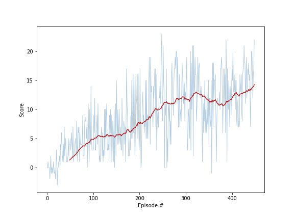
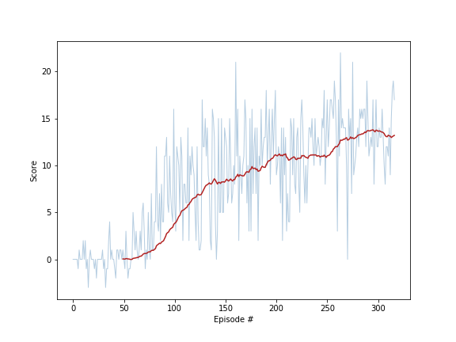

# Project 1: Navigation report

## Table of content
* [1. Introduction](#introduction)
* [2. Solutions Overview](#overview)
  * [2.1 Vanilla DQN](#vanilla-dqn)
  * [2.2 Double DQN](#double-dqn)
  * [2.3 Double DQN with 20% dropout](#ddqn-dropout)
  * [2.3 Double DQN with Prioritize Experience Replay](#per-ddqn)
* [3. Conclusion](#conclusion)
  * [3.1 Findings](#findings)
  * [3.2 Ideas for future work](#future-work)

## 1. Introduction
<a id="introduction"></a>

For this project, we will train an agent to navigate (and collect bananas!) in a large, square world.  

A reward of +1 is provided for collecting a yellow banana, and a reward of -1 is provided for collecting a blue banana.  Thus, the goal of the agent is to collect as many yellow bananas as possible while avoiding blue bananas.  

The state space has 37 dimensions and contains the agent's velocity, along with ray-based perception of objects around agent's forward direction.  Given this information, the agent has to learn how to best select actions.  Four discrete actions are available, corresponding to:
- **`0`** - move forward.
- **`1`** - move backward.
- **`2`** - turn left.
- **`3`** - turn right.

The task is episodic, and in order to solve the environment, the agent must get an average score of +13 over 100 consecutive episodes.


## 2. Solution Overview
<a id="overview"></a>

This project features 4 different variations of a Deep Q-Network based Deep Reinforced Learning models to automate the collection of bananas with the above environment.  The 4 models trained are all successful in acheiving the targeted average score but vary in stability and perfromance.  The 4 solutions featured are:
    - A basic standard Deep Q-Network (DQN)
    - A Double Deep Q-Network (DDQN)
    - A DDQN incorporating a 20% dropout layer
    - A DDQN with Prioritize Experience Replay (PER) and a 20% dropout layer

Our approach consists in:
    1. re-use Vanilla DQN with hyperparameters used to earlier in the Udacity DRL Nanodegree;
    2. based on visual observation of agent's behaviour during learning, guessing more optimal hyperparameters;
    3. experiment with 4 variations on the base DNQ graphing their rolling average mean
    4. explore hyperparameters space to find out "best parameters";


### 2.1 Vanilla DQN with default parameters
<a id="vanilla-dqn"></a>

#### Training
We first implemented a Vanilla DQN approach with the following agent and DQN hyperparameters:

    Using hyperparameters from data/dqn-vanilla/params.json:
    
    ```
    n_episodes=1800                   # maximum number of training episodes
    max_t=300                         # maximum number of timesteps per episode
    eps_start=1.0                     # starting value of epsilon, for epsilon-greedy action selection
    eps_end=0.01                      # minimum value of epsilon
    eps_decay=0.97                    # multiplicative factor (per episode) for decreasing epsilon

    hidden_layers=[64, 64]            # nb. of hidden layers and unit per layer of neural network
    buffer_size=int(1e5)              # size of replay buffer
    batch_size=32                     # learning samples batch size
    gamma=0.99                        # discount factor
    lr=0.001                          # learning rate
    ```

    It is important to note that the choice of these parameters is somewhat arbitrary and simply inherited from a previous environment. However, as a first attempt, keeping exploration high with a large discount factor looks like a sensible choice.

    The plot below shows that although this quite arbitrary choice, the agent is able to learn and solve the environment in 400 episodes.

    
    
    with are training result:
    Environment solved in 400 episodes!	Average Score: 13.00	Elapse time: 1303.51

#### Evaluation
    On running the trained model from weights saved in 'dqn-vanilla-model.pth' proved successfull as:
        Environment solved in 1 episodes!	Average Score: 15.00	Elapse time: 30.42


### 2.2 Double DQN
<a id="double-dqn"></a>

As Reinforcement Learning algorithms are notoriously unstable the primary aim of the next 3 experiments was to improve stability by adding complexity and tuning hyperparameters.  In our particular context, while watching the agent learning, we notice that:
* based on agent's distance from closest bananas, exploration required may vary (it looks a bit irrelevant to oscillate many times left, right, ... at each step when closest bananas are far away);
* at the same time, the agent gets hooked by walls quite frequently and needs randomness in order to get off the wall and continue its "trip".

#### Training

    Using hyperparameters (basicly unchanged) from data/double-dqn/params.json, we can see that indeed, the agent solves the environment in almost the same 400 episodes, but with greater stability. 

    

#### Evaluation
    On running the trained model from weights saved in 'double-dqn-model.pth' proved successfull as:
        Environment solved in 1 episodes!	Average Score: 18.00	Elapse time: 30.22


### 2.3 Double DQN with 20% dropout
<a id="ddqn-dropout"></a>

Next we added a dropout layer with a 20% probability parameter to mimimize overfitting during learning.  We found that we also needed to reduce the Update_rate to every update to maintain stability.

#### Training

    Using hyperparameters (basicly unchanged) from data/double-dqn/params.json, we indeed observe a faster learning with:
    Environment solved in 280 episodes!	Average Score: 13.00	Elapse time: 2053.22


    

#### Evaluation
    On running the trained model from weights saved in 'ddqn-dropout-model.pth' proved successfull as:
        Environment solved in 1 episodes!	Average Score: 20.00	Elapse time: 29.99


### 2.4 Double DQN with Prioritize Experience Replay
<a id="per-ddqn"></a>

Finally, we added in the use of a Prioritize Experience Replay buffer to the DDQN with a 20% dropout rate.  By playing with the beta hyperparameter we found greatest stability as when it was set to reach 1 close to the target point.

#### Training

    Using hyperparameters from data/ddqn-per/params.json:
    
    ```
            alpha=0.4              # prioritization level (ALPHA=0 is uniform sampling so no prioritization)
            beta_start=0.4         # controls how much IS weightings affect learning (beta=0 at start moving to 1 towards the end )
            beta_increments=300    # the number of intervals beta will increase to get to 1.0
            update_rate=1          # how often to update the network
    ```

    We do observe a clear improvement.
        Environment solved in 176 episodes!	Average Score: 13.03	Elapse time: 1933.13

    


#### Evaluation
    On running the trained model from weights saved in 'ddqn-per-model.pth' proved successfull as:
        Environment solved in 1 episodes!	Average Score: 20.00	Elapse time: 29.85


## 3. Conclusion
<a id="Conclusion"></a>

### 3.1 Findings
<a id="findings"></a>

### 3.2 Ideas for future work
<a id="future-work"></a>

As regards potential improvements, we can obviously implement DQN improved algorithms such as Dueling, Rainbow, ... We assume we would get better results. However, we are convinced that a systematic exploration of the hyperparameters, several Neural Networks architecture, ... would be even more critical to build an agent with greater stability and confidence.

Additionnally, it would be interesting to find out how learning from a CNN watchings pixels would vary from using the set environment.


